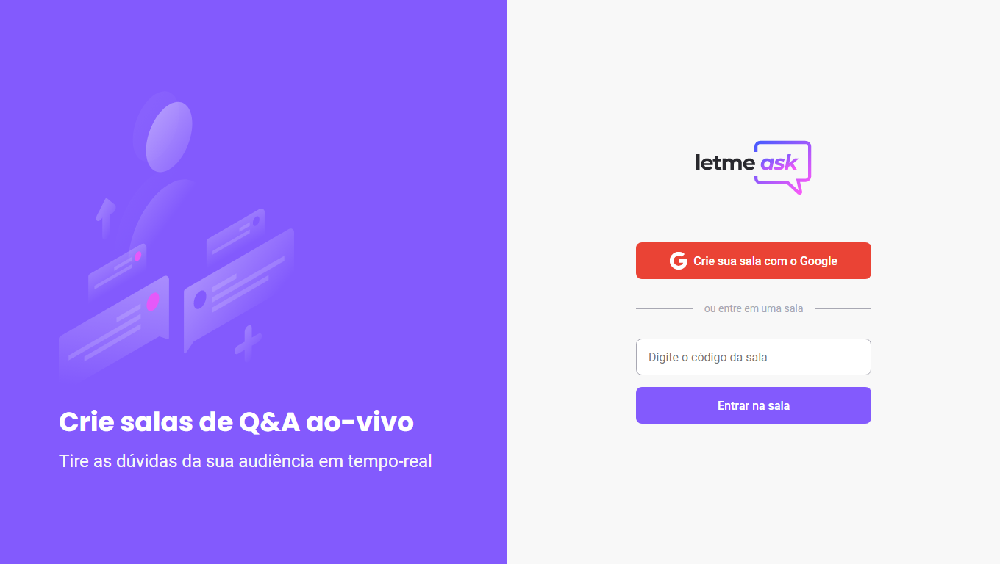

# letmeask

## 💻 Projeto
Projeto desenvolvido na NLW together. Evento realizado pela [Rocketseat](https://www.rocketseat.com.br/).

## 🧪 Tecnologias
Esse projeto foi desenvolvido com as seguintes tecnologias:

- [React](https://reactjs.org)
- [Firebase](https://firebase.google.com/)
- [TypeScript](https://www.typescriptlang.org/)

## 📝 License

Esse projeto está sob a licença MIT. Veja o arquivo [LICENSE](LICENSE.md) para mais detalhes.
